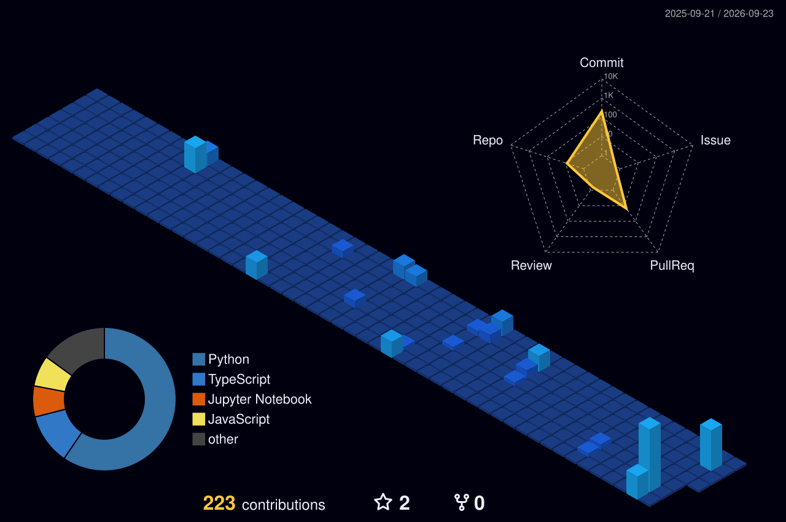

<!--
  Abdulrahman Ammar — Profile README
  Local animated assets live in /assets. The 3D contribution calendar in
  /profile-3d-contrib is generated by the GitHub Action (.github/workflows/profile-3d.yml).
  See SETUP.md for deploy steps.
-->

<!-- ===================== ANIMATED HEADER ===================== -->

  

<!-- ===================== TYPING HEADLINE ===================== -->

  

<!-- ===================== SOCIAL BADGES ===================== -->

 

<!-- ===================== ABOUT + 3D CHARACTER ===================== -->
<table>
<tr>
<td width="62%" valign="top">

## 💫 About Me

I'm a builder who's always been obsessed with the space where a messy real-world problem meets a clean line of code. My journey started at **KFUPM**, where I dove deep into Software Engineering and AI — but it really came to life when I started applying those theories to things people actually touch and use.

Whether I was on the ground at **Barri Logistics** redesigning workflows, or late at night fine-tuning a **Computer Vision** model to recognize objects, I've learned that the best tech is the kind that feels invisible because it works so well.

I've worn a few hats — from a **Teaching Assistant** breaking down complex algorithms to a developer building **Smart Warehouse systems** — but the goal is always the same: move past *"it works on my machine"* and deliver something that actually moves the needle.

For me it's not just about the stack (though I'm partial to **React** and **Node**) — it's about the story the data tells and the impact the final product leaves behind.

</td>
<td width="38%" valign="middle" align="center">

</td>
</tr>
</table>

---

<!-- ===================== TECH STACK ===================== -->

## 💻 Tech Stack

🌳 A skill tree that lights up as each branch unlocks — full arsenal in the badges below 👇

#### 🛠️ Languages
      

#### 🌐 Frameworks & Libraries
     

#### 🧠 AI / ML / Data Science
      

#### ⚙️ Tools & Databases
      

---

<!-- ===================== PROJECTS ===================== -->
## 🚀 Key Projects

<table>
<tr>
<td width="38%" align="center" valign="middle">

</td>
<td width="62%" valign="top">

### 🦊 Thaheen — Gamified Learning Platform

An interactive **question-generation and gamified learning** system built to lift university students' academic performance. It tackles a problem every student hits — the shortage of practice questions in core courses — and layers on **Kahoot!-style live events** to make studying genuinely fun. The need was validated through a survey and one-on-one student interviews.

Role-based by design: **Admin** (users, settings, analytics dashboard), **Question Master** (content quality, ratings, adding/refining questions), **Regular User / Student** (practice by course & lesson, rate questions, create activities, leaderboards), and **Guest** (browse only).

  
&nbsp;

</td>
</tr>

<tr>
<td width="38%" align="center" valign="middle">

</td>
<td width="62%" valign="top">

### 🏦 Arabic Bank Check Recognition Pipeline

A **4-stage** Arabic check verification system — **YOLOv8s** field detector → **CRNN-CTC** digit reader → character-level **CRNN** → rule-based cross-verifier — trained on **2,400 checks**. Reached **95.17% digit accuracy**, **9.02% legal CER**, and **82.0% end-to-end accuracy**, beating the **78.5%** paper benchmark through custom **RTL preprocessing** and dictionary post-processing.

   

</td>
</tr>

<tr>
<td width="38%" align="center" valign="middle">

</td>
<td width="62%" valign="top">

### 🎨 Zero-Shot Object Insertion with Diffusion Models — *StressDoor*

Co-authored research extending **AnyDoor**. Diagnosed a **mask-collapse** preprocessing bottleneck affecting **22%** of stress cases, then trained a **rank-8 LoRA** adapter on **DINOv2** and built a **DINOv2 + CLIP token-fusion** module — lifting harmonization quality from **0.578 → 0.655**.

   

</td>
</tr>

<tr>
<td width="38%" align="center" valign="middle">

</td>
<td width="62%" valign="top">

### 🏭 Smart Warehouse Platform — Senior Capstone

Leading a **5-member team** building an **AI demand-forecasting** model (**90.7% accuracy**) with computer vision and an **LLM assistant** to cut stockouts for Saudi SMEs (**Vision 2030**). Engineered a real-time **IoT ingestion pipeline** — **ESP32 → MQTT → PostgreSQL** — feeding a **React** dashboard.

    

</td>
</tr>

<tr>
<td width="38%" align="center" valign="middle">

</td>
<td width="62%" valign="top">

### 🤟 Pose-Based Saudi Sign Language Recognition

An end-to-end pipeline translating **continuous 3D skeletal-pose sequences** into **Arabic gloss text** using **BiLSTM / Conformer** encoders with **CTC** decoding. Applied pose normalization and augmentation to handle signer variation, improving sequence-level recognition robustness.

  

</td>
</tr>
</table>

---

<!-- ===================== 3D CONTRIBUTION CALENDAR ===================== -->

## 🧊 My Year in 3D

<!-- Auto-generated daily by the github-profile-3d-contrib Action (.github/workflows/profile-3d.yml).
     "night-view" is an animated variant (bars rise + twinkling sky). It appears only after the workflow has run once.
     Browsers auto-play looping SVG animation when it scrolls into view and pause it when off-screen. -->

---

<!-- ===================== GITHUB STATS ===================== -->

## 📊 GitHub Stats

 

### 📈 Contribution Activity

## 🏆 GitHub Trophies

### ✍️ Random Dev Quote