<!--
  ╔══════════════════════════════════════════════════════════════════╗
  ║  Abdulrahman Ammar — Profile README                                ║
  ║  Asset paths assume:  /assets/*.svg  and  /game/index.html         ║
  ║  See SETUP.md for repo structure + GitHub Pages deploy steps.      ║
  ╚══════════════════════════════════════════════════════════════════╝
-->

<!-- ===================== ANIMATED HEADER ===================== -->

  

<!-- ===================== TYPING HEADLINE ===================== -->

  

<!-- ===================== SOCIAL BADGES ===================== -->

 

 

<!-- ===================== ABOUT + 3D CORE ===================== -->
<table>
<tr>
<td width="62%" valign="top">

## 💫 About Me

I'm a builder who's always been obsessed with the space where a messy real-world problem meets a clean line of code. My journey started at **KFUPM**, where I dove deep into Software Engineering and AI — but it really came to life when I started applying those theories to things people actually touch and use.

Whether I was on the ground at **Barri Logistics** redesigning workflows, or late at night fine-tuning a **Computer Vision** model to recognize objects, I've learned that the best tech is the kind that feels invisible because it works so well.

I've worn a few hats — from a **Teaching Assistant** breaking down complex algorithms to a developer building **Smart Warehouse systems** — but the goal is always the same: move past *"it works on my machine"* and deliver something that actually moves the needle.

For me it's not just about the stack (though I'm partial to **React** and **Node**) — it's about the story the data tells and the impact the final product leaves behind.

</td>
<td width="38%" valign="middle" align="center">

</td>
</tr>
</table>

<!-- ===================== INTERACTIVE GAME ===================== -->

## 🎮 "Detect the Object" — a CV mini-game I built

Bounding boxes lock onto targets, then fade. Click them before your model loses track. It gets faster — how long can you keep up? The preview below runs on a loop; hit **Play** for the full interactive version.

  

---

<!-- ===================== TECH STACK ===================== -->

## 💻 Tech Stack

#### 🛠️ Languages
      

#### 🌐 Frameworks & Libraries
     

#### 🧠 AI / ML / Data Science
      

#### ⚙️ Tools & Databases
       

---

<!-- ===================== PROJECTS ===================== -->
## 🚀 Key Projects

### 📦 Smart Warehouse Management System
A graduation project optimizing logistics using **YOLO-based Computer Vision** and IoT sensors to track inventory in real-time.

   

### 🏋️ AI Fitness Trainer
A real-time exercise feedback app using pose estimation to help users correct their form.

  

---

<!-- ===================== GITHUB STATS ===================== -->

## 📊 GitHub Stats

 

<!-- ===================== ACTIVITY GRAPH ===================== -->
### 📈 Contribution Activity

## 🏆 GitHub Trophies

### ✍️ Random Dev Quote

---

  <i>⚡ "The best tech feels invisible because it works so well."</i>

